# 🇮🇳 VikasDrishti AI (विकास दृष्टि)
### *Voice-to-Policy Digital Public Good for Infrastructure Governance*
**Built for the Google Build With AI Hackathon 2026**

[](https://aistudio.google.com/)
[](https://cloud.google.com/vertex-ai)
[](https://firebase.google.com/)
[](https://www.sqlite.org/)
[](https://vitejs.dev/)

---

## 📌 Executive Summary

Over **700 Million citizens** in India's rural and semi-urban aspirational districts communicate in regional dialects across 22+ languages. When critical infrastructure breaks down — broken bridges, contaminated water supplies, or burnt electrical transformers — citizens face severe bureaucratic friction trying to file complaints on text-heavy portals.

Meanwhile, government departments allocate over **₹3+ Lakh Crore annually** (via PMGSY, Jal Jeevan Mission, AMRUT) often relying on delayed annual surveys or discretionary lobbying, leading to a perpetual cycle of **reactive repairs after catastrophic failures**.

**VikasDrishti AI (विकास दृष्टि)** bridges this gap. It is an end-to-end **Voice-to-Policy Digital Public Good** that captures multilingual citizen voice notes and photo evidence, validates civic damage with **Gemini 2.0 Flash**, stores verified data in a high-performance **SQLite database**, predicts infrastructure failure 6–12 months ahead with **Vertex AI AutoML models**, and synthesizes transparent resource allocations via the **Explainable Priority Index (EPI)**.

---

## 🏛️ System Architecture

```mermaid
flowchart TD
    subgraph Citizens["🗣️ Citizen Tier (Jan-Samvaad Portal)"]
        A1["Voice Input (Web Speech API in 10+ Dialects)"]
        A2["Photo Evidence Upload (Potholes, Burst Pipes)"]
        A3["GPS Geolocation Capture"]
    end

    subgraph GoogleAI["✨ Google AI Studio (Multimodal Pipeline)"]
        B1["Gemini 2.0 Flash Intent & NER Extraction"]
        B2["Gemini Vision Civic Damage Audit & Anti-Spam"]
        B3["Automated Urgency Reasoning & Sector Tagging"]
    end

    subgraph DataLayer["🗄️ Unified Data & Backend Layer"]
        C1["Express REST API (Port 5000)"]
        C2[("SQLite Database: vikasdrishti.db (WAL Mode)")]
        C3["Firebase Cloud Firestore (Real-time Edge Sync)"]
        C4["BigQuery Open Dataset Synthesis (data.gov.in / PMGSY)"]
    end

    subgraph PredictiveEngine["⚡ Predictive & Scoring Intelligence"]
        D1["Explainable Priority Index (EPI Mathematical Engine)"]
        D2["Vertex AI AutoML Time-Series Failure Forecaster (12-Mo Horizon)"]
    end

    subgraph Studio["📊 Policymaker Decision Studio"]
        E1["GIS Spatial Heatmap (Leaflet Drilldown)"]
        E2["Live EPI District Rankings & Audit Trails"]
        E3["What-If Capital Reallocation Simulator"]
        E4["1-Click Formal Cabinet Policy Memorandum Export"]
    end

    Citizens --> GoogleAI
    GoogleAI --> DataLayer
    DataLayer --> PredictiveEngine
    PredictiveEngine --> Studio
```



---

## 💡 The Core Innovation: Explainable Priority Index (EPI)

Unlike opaque machine learning models that administrators cannot trust or defend during legislative audits, VikasDrishti AI prioritizes districts and projects using an **auditable, mathematically grounded formula**:

$$\text{EPI} = w_1(\text{Demand Density}) + w_2(\text{Vulnerability Index}) + w_3(\text{Infra Gap}) + w_4(\text{Budget Slack}) + \text{Urgency Bonus}$$

### Mathematical Weight Breakdown
1. **Demand Density ($w_1 = 0.30$):** Real-time citizen grievance reports weighted by severity and community endorsements per 100k population.
2. **Vulnerability Index ($w_2 = 0.25$):** Socio-economic vulnerability: $\text{BPL Ratio} \times (1 - \text{Literacy Rate})$.
3. **Infrastructure Gap ($w_3 = 0.25$):** $(100 - \text{Baseline Infrastructure Score}) / 100$, covering water, road, health, and power deficits.
4. **Budget Slack ($w_4 = 0.20$):** Unutilized capital capacity from prior allocations: $1 - (\text{Budget Utilized} / \text{Budget Allocated})$.
5. **Critical Urgency Bonus:** Extra weight added dynamically when life-threatening failures (e.g. arsenic water, collapsed river bridge) are detected.

Every single priority score in the studio features a **1-click expandable mathematical audit trail** showing the exact formula, weights, and timestamps.

---

## 🗃️ Persistent Database & Data Model

The application does **not** rely on static hardcoded data. It features a persistent relational **SQLite database** (in high-concurrency WAL mode) running on Node 24’s native `DatabaseSync` engine:

- **`districts` table**: 80 Indian Aspirational Districts (Barmer, Purnia, Kupwara, Nuapada, Virudhunagar, Damoh, Sonbhadra, Dahod, Dharashiv, Yadgir, etc.) with demographic, vulnerability, infrastructure, and budget metrics.
- **`grievances` table**: 80+ authentic citizen grievance records across 10 Indian languages with coordinates, categories, severity ratings, and community upvotes.
- **`audit_logs` table**: Immutable governance ledger recording every grievance submission, upvote, and priority update.

---

## 🛠️ Google Technologies Utilized

| Google Tech | Category | Implementation in VikasDrishti AI |
|:---|:---|:---|
| **Google AI Studio / Gemini 2.0 Flash** | Generative AI & Multimodal | • Multilingual intent & entity extraction (Hindi, Tamil, Marathi, Bengali, Odia, Gujarati, etc.)<br>• Gemini Vision photo verification for infrastructure damage<br>• Automated district policy briefs with UN SDG alignment<br>• Interactive What-If capital reallocation budget simulator |
| **Vertex AI** | Predictive Modelling | • 12-month AutoML time-series infrastructure stress forecasting<br>• Early-warning matrix identifying failure risks before summer/monsoon seasons |
| **Firebase** | Cloud Database & Hosting | • Cloud Firestore real-time synchronization bridge<br>• Ready-to-deploy Firebase Hosting configuration (`firebase.json`, `.firebaserc`) |
| **BigQuery (Data Models)** | Public Data Ingestion | • Demographics, BPL ratios, PMGSY road networks, and Jal Jeevan Mission telemetry modeled after open datasets from data.gov.in & ISRO Bhuvan |

---

## 🚀 Quick Start Guide

### Prerequisites
- Node.js **v22+** or **v24+** (tested with v24.14.0)
- npm v10+

### 1. Clone the Repository
```bash
git clone https://github.com/mukesh-dev-git/BuildWithAI-2E-26.git
cd BuildWithAI-2E-26
```

### 2. Install Dependencies
```bash
npm install
```

### 3. Seed the SQLite Database
Populate 80 Indian Aspirational Districts and 80+ citizen complaints:
```bash
npm run db:seed
```

### 4. Start the Full-Stack Application
Runs both the Express backend API (Port 5000) and the Vite frontend simultaneously:
```bash
npm run dev
```

- **Frontend Portal:** [http://localhost:5174/](http://localhost:5174/) (or [http://localhost:5173/](http://localhost:5173/))
- **Backend REST API:** [http://localhost:5000/api/health](http://localhost:5000/api/health)

---

## 📡 REST API Endpoints

| Method | Endpoint | Description |
|:---|:---|:---|
| `GET` | `/api/health` | Live database health, table counts, and engine status |
| `GET` | `/api/districts` | List all districts with live aggregated grievance counts |
| `GET` | `/api/districts/:id` | District profile with its associated citizen reports |
| `GET` | `/api/grievances` | List citizen grievances with category, severity, and district filters |
| `POST` | `/api/grievances` | **Inserts a new grievance into the SQLite database**, logs an audit entry, and recalculates district metrics |
| `POST` | `/api/grievances/:id/upvote` | Atomically increments community endorsement votes in SQLite |
| `GET` | `/api/epi` | **Computes live Explainable Priority Index rankings directly from SQL** |
| `POST` | `/api/seed` | Reset and re-seed the SQLite database on demand |

---

## 🎯 3-Minute Live Demo Pitch Walkthrough

### 1. Citizen Voice Reporting (`/citizen`)
1. Open [http://localhost:5174/citizen](http://localhost:5174/citizen).
2. Click on any of the **1-Click Quick Prompts** (e.g. *"💧 Water Crisis in Barmer"* or *"🛣️ Broken Road/Bridge in Purnia"*).
3. Click **Submit Grievance**.
4. Observe **Gemini 2.0 Flash** extract category, urgency, responsible department, and generate AI reasoning.
5. The issue is immediately persisted to the **SQLite database** and synced across portals.

### 2. Policymaker Decision Studio (`/policymaker`)
1. Open [http://localhost:5174/policymaker](http://localhost:5174/policymaker).
2. The newly submitted grievance is already reflected in the real-time summary statistics.
3. Switch to the **🗺️ GIS Heatmap** tab to explore spatial clusters across India.
4. Switch to the **🏆 EPI Rankings** tab to inspect the exact mathematical audit trail for each district.

### 3. Predictive AI & Cabinet Memo
1. Click the **⚡ Vertex AI Forecasting** tab to view the 12-month projected infrastructure stress curves and seasonal risk triggers.
2. Click the **💰 Budget Simulator** tab to run a What-If scenario (e.g. allocating +₹50 Cr to Water in Barmer) and view AI impact predictions.
3. Click **Export Cabinet Policy Memo** to view and print an official, formatted Government Memorandum ready for executive review.
4. Click **Google AI Stack** in the navbar to test live Google AI Studio API keys and inspect architecture health.

---

## 👥 Authors & Team
- **Built for:** Google Build With AI Hackathon 2026
- **Repository:** [mukesh-dev-git/BuildWithAI-2E-26](https://github.com/mukesh-dev-git/BuildWithAI-2E-26)
- **License:** MIT License (Digital Public Good)
