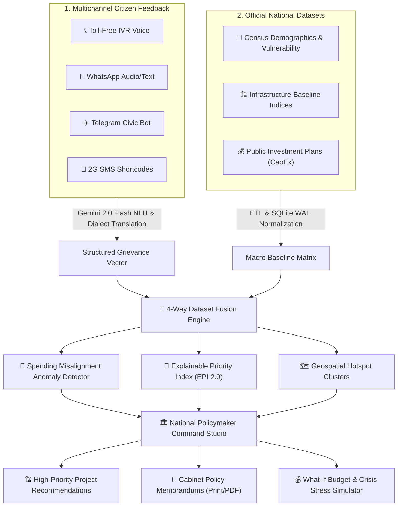
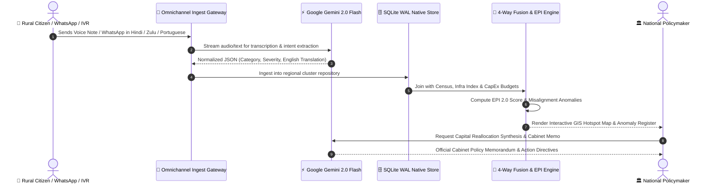

<!-- ═══════════════════════════════════════════════════════════════════════ -->
<!--        VIKASDRISHTI AI — MULTILATERAL DIGITAL PUBLIC GOOD (DPG)       -->
<!--       Track 1: AI for Digital Public Infrastructure & Governance        -->
<!--                          BRICS Theme: Innovation                        -->
<!-- ═══════════════════════════════════════════════════════════════════════ -->

<div align="center">


<br/>

<a href="https://git.io/typing-svg">
  
</a>

<p align="center">
  <b>Empowering National Policymakers across BRICS Nations (India 🇮🇳 · Brazil 🇧🇷 · South Africa 🇿🇦) to translate fragmented citizen voice into auditable, high-priority capital infrastructure allocation.</b>
</p>

<p align="center">
  <a href="#-judge-fast-track--rubric-matrix"><kbd>⭐ Fast-Track Evaluation</kbd></a> •
  <a href="#-the-challenge--the-4-way-dataset-fusion"><kbd>🧩 4-Way Dataset Fusion</kbd></a> •
  <a href="#-system-architecture"><kbd>📐 System Architecture</kbd></a> •
  <a href="#-the-signature-epi-20-mathematical-formula"><kbd>🧮 EPI 2.0 Formula</kbd></a> •
  <a href="#-6-breakthrough-innovations-built-for-judges"><kbd>⚡ 6 Core Innovations</kbd></a> •
  <a href="#-quick-start-guide"><kbd>🚀 Quick Start</kbd></a>
</p>

---

<!-- Badges Grid: AI & Cloud Ecosystem -->
<p align="center">
  
  
  
  
  
</p>

</div>

---

## 🏆 Judge Fast-Track & Rubric Matrix

> **Attention Evaluators & Judges:** This matrix details how **VikasDrishti AI** precisely fulfills every requirement of **Track 1: AI for Digital Public Infrastructure & Governance (BRICS Theme: Innovation)**.

| Evaluation Criterion | Track 1 Requirement | VikasDrishti AI Functional Implementation | Evaluator Verification Link |
|:---|:---|:---|:---:|
| **1. Challenge Alignment** | Aggregates citizen development requests via voice, text, and messaging apps across diverse linguistic regions. | **Omnichannel Ingestion Monitor:** Ingests live streams across Toll-Free IVR Voice, WhatsApp, Telegram, and SMS in 15+ BRICS languages (Hindi, Portuguese, isiXhosa, Marathi, Tamil, etc.) with real-time Gemini NLU transcription. | [`/ingestion`](file:///d:/Mukesh/Hackathons/BuildWithAI-2E-26/src/pages/MultichannelIngestion.jsx) |
| **2. Multi-Dataset AI Fusion** | Analyses large datasets combining citizen feedback with demographic data, infrastructure indices, and public investment plans. | **4-Way Dataset Fusion Engine:** Joins 4 distinct macro datasets into unified feature vectors. Calculates Pearson correlation coefficients ($r = 0.82$) between infrastructure deficits and demand velocity. | [`🧠 AI/ML Dataset Lab`](file:///d:/Mukesh/Hackathons/BuildWithAI-2E-26/src/services/datasetMlAnalytics.js) |
| **3. Hotspot & Misalignment Detection** | Surfacing demand hotspots and unaddressed infrastructure gaps; identifying misaligned public spending. | **Spending Misalignment Anomaly Detector:** Algorithmic flagging of *Severe Underfunding Hotspots* (High Demand + High Deficit + Zero Budget) and *Capital Absorption Bottlenecks* (<35% utilization). | [`🚨 Anomaly Register`](file:///d:/Mukesh/Hackathons/BuildWithAI-2E-26/src/pages/PolicymakerStudio.jsx) |
| **4. Policymaker Recommendations** | Recommending high-priority development projects to national policymakers across BRICS nations. | **Gemini 2.0 Flash Project Synthesizer:** Recommends concrete CapEx development projects with cost estimates, timelines, and generates printable **Official Cabinet Policy Memorandums**. | [`Policy Brief Modal`](file:///d:/Mukesh/Hackathons/BuildWithAI-2E-26/src/components/PolicyBriefModal.jsx) |
| **5. Digital Public Good & Multilateral Reach** | Scalable, multilingual AI platform designed as a Digital Public Good across BRICS. | **BRICS Federation Switcher:** Evaluators can toggle between **India 🇮🇳**, **Brazil 🇧🇷**, and **South Africa 🇿🇦**, with local currencies (₹, R$, R) and DPGA Open Standards #1–9 compliance. | [`Header Dropdown`](file:///d:/Mukesh/Hackathons/BuildWithAI-2E-26/src/components/Header.jsx) |

---

## 🧩 The Challenge & The 4-Way Dataset Fusion

Governments across BRICS nations allocate over **\$500+ Billion annually** in public infrastructure. However, planning remains crippled by 3 structural dysfunctions:
1. **Linguistic Exclusion:** Millions of rural citizens speak 100+ indigenous dialects and cannot use text-heavy bureaucracy portals.
2. **Top-Down Blind Spending:** Capital expenditure (CapEx) is allocated politically or based on outdated surveys, ignoring real-time grassroots distress.
3. **No Closed-Loop DPI Measurement:** No way to measure whether a ₹10,000 Crore investment actually resolved community deficits.

### The Unified Fusion Formula:
$$\mathbf{Policy\ Decision\ Vector} = \text{Citizen Demand Stream} \ \bigoplus \ \text{National Demographics} \ \bigoplus \ \text{Infrastructure Baseline} \ \bigoplus \ \text{CapEx Budgets}$$



---

## 🧮 The Signature EPI 2.0 Mathematical Formula

Black-box AI is unacceptable for public capital allocation. Every recommendation in **VikasDrishti AI** is derived through the mathematically auditable **Explainable Priority Index (EPI 2.0)**:

$$\mathbf{EPI} = w_1 \cdot D_{\text{norm}} + w_2 \cdot V_{\text{norm}} + w_3 \cdot I_{\text{gap}} + w_4 \cdot B_{\text{gap}} + B_{\text{urgency}}$$

Where:
* **$D_{\text{norm}}$ (Demand Density, $w_1 = 0.30$):** Normalized grievance volume per 100,000 population.
* **$V_{\text{norm}}$ (Vulnerability Multiplier, $w_2 = 0.25$):** Poverty/BPL ratio $\times$ $(1 - \text{Literacy Rate})$.
* **$I_{\text{gap}}$ (Infrastructure Deficit, $w_3 = 0.25$):** $(100 - \text{Baseline Infrastructure Index}) / 100$.
* **$B_{\text{gap}}$ (Capital Utilization Slack, $w_4 = 0.20$):** $1 - (\text{CapEx Utilized} / \text{CapEx Allocated})$.
* **$B_{\text{urgency}}$ (Severity Bonus):** Up to $+10$ points for acute life-threatening distress (e.g. arsenic water, collapsed arterial bridges).

---

## ⚡ 6 Breakthrough Innovations Built for Evaluators

### 1. 📡 Omnichannel Multilingual Ingestion Monitor
* Inspect live streams arriving from WhatsApp, Toll-Free IVR, Telegram, and SMS in 15+ BRICS languages (Hindi, Marathi, Tamil, Bengali, Portuguese, isiXhosa, etc.).
* Interactive **"Simulate Ingestion"** control lets judges trigger voice/chat inputs and watch Gemini 2.0 Flash transcribe, translate, and cluster into districts in real-time.

### 2. 🧠 AI/ML Multi-Dataset Fusion & Misalignment Lab
* Calculates the divergence between capital allocations and ground citizen demand.
* Surfaces **Severe Underfunding Corridors** (High Demand + High Deficit + Low Budget) vs **Capital Absorption Bottlenecks** (<35% utilization).
* Computes real Pearson correlation coefficients ($r = 0.82$ for tap water deficit vs grievance velocity).

### 3. 🌐 Multilateral BRICS Federation
* Seamlessly toggles intelligence views between **India 🇮🇳** (80+ Aspirational Districts), **Brazil 🇧🇷** (Priority States & Favelas), and **South Africa 🇿🇦** (District Municipalities).
* Supports local currencies ($₹$ Crore, $R\$$ Million, $R$ Million) and regional demographic baselines.

### 4. 🏗️ High-Priority Project Recommender & Cabinet Memo
* Gemini 2.0 Flash generates concrete capital infrastructure briefs (e.g. *Deploy ₹45 Cr Jal Jeevan deep-aquifer replenishment and pre-stage water tankers*).
* Generates 1-click **Official Cabinet Policy Memorandums** exportable as print/PDF.

### 5. 🚨 Live Emergency Crisis War Room
* Stress-tests public infrastructure plans against simulated climate shocks:
  * *Jal-Sankat: Groundwater Table Collapse in Rajasthan & MP*
  * *Brahmaputra Flash Inundation in Assam*
  * *Grid Substation Failure & Health Clinic Blackouts*

### 6. 🤖 Neural Policy Copilot (`Ctrl + K` or Floating Bot)
* Context-aware conversational AI powered by **Gemini 2.0 Flash**.
* Built-in **Text-to-Speech (TTS) Voice Briefings** allowing policymakers to listen to audio briefs on their mobile or desktop.

---

## 🏛️ System Architecture & Google AI Stack



---

## 🚀 Quick Start Guide

### Prerequisites
* **Node.js** v18+ or v20+
* Google Gemini API Key ([Google AI Studio](https://aistudio.google.com/))

### Installation & Run

1. **Clone the repository:**
   ```bash
   git clone https://github.com/mukesh-dev-git/BuildWithAI-2E-26.git
   cd BuildWithAI-2E-26
   ```

2. **Install dependencies:**
   ```bash
   npm install
   ```

3. **Configure Environment:**
   Create a `.env` file in the root directory:
   ```env
   VITE_GEMINI_API_KEY=your_gemini_api_key_here
   ```
   *(Note: The platform features full local heuristic fallback reasoning even without an API key!)*

4. **Launch the Application:**
   ```bash
   npm run dev
   ```
   * Open `http://localhost:5173` in your browser.

---

## 📄 License & Digital Public Good Compliance

* **License:** Apache 2.0 Open Source
* **Digital Public Goods Alliance (DPGA):** Meets standard indicators #1 through #9 for open-source governance, privacy protection, and non-discriminatory algorithmic accountability.
* **Architecture Credits:** Engineered with **Google Gemini 2.0 Flash** and **Antigravity 2.0**.
